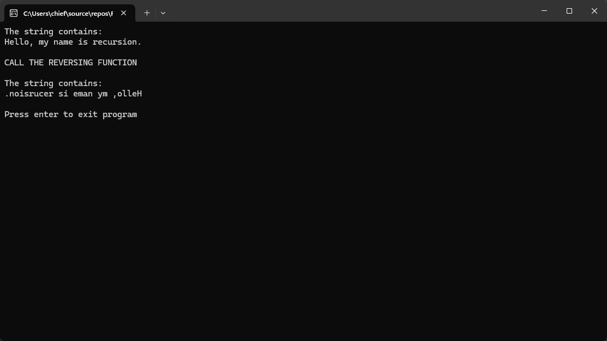

# Recursive String Reversal (C++)

This C++ program demonstrates how to **reverse a string using recursion**. It reads a C-style string (character array), reverses it in-place, and displays the result.

This is a great example of:
- Basic recursion
- String manipulation with character arrays
- Working with pointers in C-style strings

---

## ▶️ How It Works

1. The program initializes a character array with the string:
   ```
   Hello, my name is recursion.
   ```

2. It then displays the original string.

3. A recursive function `ReverseStringRecursive()` is called to reverse the string **in-place**.

4. The reversed string is then printed.

---

## 🔁 Recursive Logic Explained

The `ReverseStringRecursive(char* str)` function works by:
- Finding the length of the string
- Swapping the first and last characters
- Temporarily modifying the string to isolate the substring
- Making a **recursive call** on the inner substring
- Restoring the original structure after recursion

---

## 💡 Sample Output



---

## 🛠️ Compile & Run

Using Visual Studio:

1. Open the solution file `Reverse String Recursion.sln` in Visual Studio.
2. Build the project.
3. Run it in Debug or Release mode.

---
